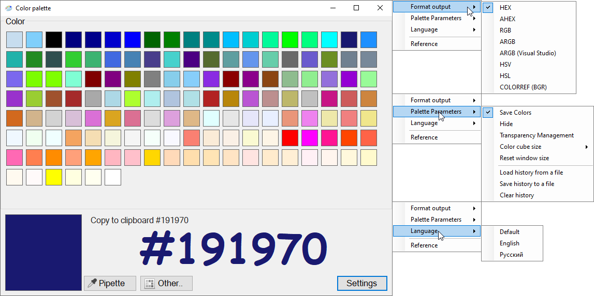

# Palette

An application for working with colors and copying colors to the clipboard.
Features:
1. The history of the selected colors is available and loading/saving HEX colors in the format (#FFFFFF) from/to a file.
2. Pipette - to work with the pipette, hold down the pipette button and hover over the desired area
3. Copy to Clipboard
click on color:
single click - display color,
double click - copy to clipboard.
4. Display colors in the format: 
HEX, AHEX, RGB, ARGB, ARGB(Visual studio), HSV, HSL, COLORREF(BGA)
(In the future, it will be possible to add a modular version of the color format)

The program is created in C#.Net Framework 4.7.2 in Visual studio environment (IDE).
In this repository, you can find the source code and the finished application. 
The application can be downloaded - [download](Palette.zip).

# Палитра
Приложение для работы с цветами и копирования в буфер обмена.
Особенности:
1. История выбранных цветов и загрузка/сохранение HEX цветов в формате (#FFFFFF) из/в файл.
2. Пипетка - для работы с пипетками удерживайте нажатой кнопку пипетки и наведите курсор на нужную область для того, чтобы получить цвет
3. Скопировать в буфер обмена
обмена нажмите на цвет:
одиночный щелчок - отобразить цвет,
двойной щелчок - скопировать в буфер обмена.
4. Отображение цветов в формате: 
HEX, AHEX, RGB, ARGB, ARGB(Visual studio), HSV, HSL, COLORREF(BGA)
(В будущем можно будет добавить модульную версию цветового формата)

Программа создана на языке C# .Net Framework 4.7.2 в среде Visual studio
В данном репозитории можно найти исходный код и готовое приложение. 
Приложение можно скачать - [скачать](Palette.zip).
